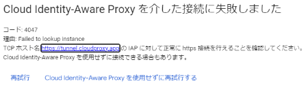

## Links

-   [Cloud Skills Boost](https://www.cloudskillsboost.google/)
-   [ラボの開始手順](https://qualia906.github.io/skillsboost/how-to-use-lab/)（「Google Cloud ラボの開始方法」を参照してください）
    
-   AWS
    -   [AWS クラウドデザインパターン](http://aws.clouddesignpattern.org/index.php/%E3%83%A1%E3%82%A4%E3%83%B3%E3%83%9A%E3%83%BC%E3%82%B8) ([アーカイブ版](http://web.archive.org/web/20171008040110/http:/aws.clouddesignpattern.org/index.php/%E3%83%A1%E3%82%A4%E3%83%B3%E3%83%9A%E3%83%BC%E3%82%B8) (※上記が閲覧できないとき))
    

-   Microsoft Azure
    -   [クラウド設計パターン](https://docs.microsoft.com/ja-jp/azure/architecture/patterns/)
  
-  Google Cloud
    -   [Google Cloud ソリューションデザインパターン](https://events.withgoogle.com/solution-design-pattern/)
    -   [Google Cloud アーキテクチャ センター](https://cloud.google.com/architecture?hl=ja)
 
<br /> 
  
## ラボリストと実行時の注意点

-   最初にラボ手順にひと通り目を通し、作業の概要を把握してから [ラボを開始] をクリックして開始してください。
-   ラボ手順と下記の各ラボの注意点をよく読みながら作業してください。
-   ラボ手順に記載のボタンやリンクの項目名は、英語と日本語を適宜読み替えてください。

<br />

### Lab 1: HTTP Load Balancer with Cloud Armor【[Open Lab Site](https://www.cloudskillsboost.google/focuses/1232?catalog_rank=%7B%22rank%22%3A2%2C%22num_filters%22%3A0%2C%22has_search%22%3Atrue%7D&parent=catalog&search_id=7978999)】

-   「インスタンステンプレートを構成する」セクションの手順 4 では [管理、セキュリティ、ディスク、ネットワーク、単一テナンシー] ではなく、画面下方の [**詳細オプション**] をクリックしてください。
    
-   同セクションで、us-east1-template をコピーして **europe-west1-template** を作成する際、**http-server** タグが設定されているか [**http トラフィックを許可する**] のチェックボックスにチェックが入っているかを確認し、どちらも設定されていなければ [ネットワークタグ] に **http-server** と入力してからインスタンス テンプレートを作成してください。
 
 -   「マネージド インスタンス グループを作成する」セクションで、自動スケーリングの指標を設定する際は、[Autoscaling Metrics] の **Undefined parameter** の部分をクリックして指定の値を入力してください。

-   「HTTP ロードバランサを構成する」セクションの「構成を開始する」手順 1, 2, 3 では、以下の手順でロードバランサーの選択をしてください。
     1. [**メニュー**] > [**ネットワーク サービス**] > [**ロードバランシング**] を選択し、[**ロードバランサを作成**] をクリックします
     2. [**HTTP(S) ロードバランシング**] の [構成を開始] をクリックします
     3. [**インターネットから VM またはサーバーレス サービスへ**] を選択します

-   Cloud Console 上で HTTP(S) ロードバランサの作成が完了ステータスになっても、実際にアクセスできるようになるまで  5 ～ 10 分かかります。  
それまでは 404 や Server Error が表示されますが、1 分ほど間隔をおいて何度かブラウザをリロードしてください。

-   「HTTP ロードバランサのストレステストを実施する」の手順 6 で、siege-vm に SSH 接続する際、「**Cloud Identity-Aware Proxy を介した接続に失敗しました**」というメッセージが表示された場合は、[**Cloud Identity-Aware Proxy を使わずに再試行する**] をクリックしてください。  
     

-   「HTTP ロードバランサのストレステストを実施する」セクションの手順 10 以降は、[**メニュー**] > [**ネットワーク サービス**] > [**ロードバランシング**] で **http-lb** をクリックし、[**モニタリング**] タブをクリックして、表示されるチャートでトラフィックの状態を確認してください。  
     


-   最後の「siege-vm をブラックリストに登録する」セクションの手順は実行しなくて構いません (時間に余裕のある方は実行しても構いません)

<br />

<br />

### Lab 2: Cloud Pub/Sub - Qwik Start (オプション)【~~Open Lab Site~~】

-   「メッセージの表示」セクションでは Cloud Shell を開いてコマンドを実行してください。

-   コマンド実行の結果 ”Listed 0 items.” が返ってきた場合は、再度コマンドを実行してみてください。

<br />    

### Lab 3: Cloud Run と Pub/Sub を使用して復元性に優れた非同期システムをビルドする 【[Open Lab Site](https://www.cloudskillsboost.google/focuses/8389?parent=catalog)】

-   [ラボ手順](https://github.com/qualia906/clouddp/blob/main/docs/lab3/index.md)（このラボ手順を使用してください）

-   Cloud Skills Boost で表示される ユーザ 1 のユーザ名でログインしてください。

<br />    

### Lab 4: Bokeh と BigQuery によるカスタム対話型ダッシュボードの作成 【[Open Lab Site](https://www.cloudskillsboost.google/focuses/1820?parent=catalog)】

-   [日本語ラボ手順](https://github.com/qualia906/clouddp/blob/main/docs/lab4/index.md)（このラボ手順を使用してください）

-   最後のセクションの Cloud Identity-Aware Proxy の設定はこのラボでは行いません  
    (日本語ラボガイドには手順を記載していません)
 
<br />

### Lab 5: Spinnaker と Kubernetes Engine による継続的デリバリーパイプライン【[Open Lab Site](https://www.cloudskillsboost.google/focuses/552?parent=catalog)】

<br />

### Lab 6: Kubernetes を使った Cloud のオーケストレーション 【[Open Lab Site](https://www.cloudskillsboost.google/focuses/557?parent=catalog)】

-  Kubernetes クラスタの作成時には、ラボガイドのコマンドではなく、以下のコマンドを実行してください。

   ```
   gcloud container clusters create io --num-nodes=4
   ```

- 「ポッドの操作」セクションで最初に

   ```
   curl http://127.0.0.1:10080/secure
   ```

   を実行すると、以下のメッセージが出力されます。  
   この時点ではこのようにエラーが返されて認可に失敗することを確認してください。

   ```
   authorization failed
   ```
